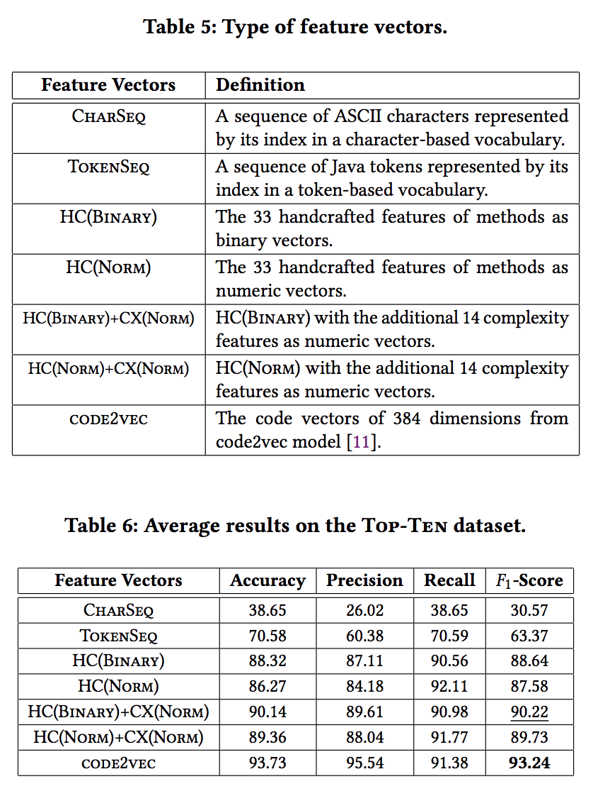

# Handcrafted Program Embeddings

This project contains the source code for the paper 'Towards Demystifying Dimensions of Source Code Embeddings' ([arXiv](https://arxiv.org/abs/2008.13064), [ACM DL](https://dl.acm.org/doi/10.1145/3416506.3423580)) accepted at the [RL+SE&PL'20](https://rlsepl-fse.github.io/) workshop, co-located with [ESEC/FSE'20](https://2020.esec-fse.org/track/esecfse-2020-workshops) conference.

## Structure

```
├── HandcraftedExtractor/   # extractor to extract handcrafted embeddings of Java programs.
├── images/                 # some figures and tables from the paper for README.
├── report/                 # scripts to generate figures and tables.
├── svm-handcrafted/        # scripts to dump SVMlight format data and train models.
├── temp/                   # temoprary working files, skip it.
``` 

---

## Workflow:


---

## Top-Ten Deduplication Datasets:

- Download [Java-large](https://github.com/tech-srl/code2seq#java) dataset.
- Extract methods from class file (i.e. [JavaMethodExtractor](https://github.com/mdrafiqulrabin/tnpa-generalizability/tree/master/NPM-IST21/JavaMethodExtractor)).
- Apply [DuplicateCodeDetector](https://github.com/microsoft/near-duplicate-code-detector/tree/master/DuplicateCodeDetector) to remove near duplicate methods.
- Select ten most-frequent methods (i.e. [topN](https://github.com/mdrafiqulrabin/handcrafted-embeddings/blob/master/temp/sample/topN.py)).

---

## Feature List and Vector Type:

- Run [HandcraftedExtractor](https://github.com/mdrafiqulrabin/handcrafted-embeddings/blob/master/HandcraftedExtractor) to extract handcrafted embeddings.
- Check [code2vec](https://github.com/tech-srl/code2vec#exporting-the-code-vectors-for-the-given-code-examples) for path-based code vectors.
- Check [naive_embeddings](https://github.com/mdrafiqulrabin/code_naive_embeddings) for sequence-based naive baselines.
- Check [complexity_embeddings](https://github.com/mdrafiqulrabin/code_complexity_embeddings) for code complexity metrics.
- 
 

---

## SVM-Handcrafted:

- Download source code/binaries of [SVMlight](http://svmlight.joachims.org/).
- Run [data_light.py](https://github.com/mdrafiqulrabin/handcrafted-embeddings/blob/master/svm-handcrafted/data_light.py) to dump SVMlight format file.
- Run [model_light.py](https://github.com/mdrafiqulrabin/handcrafted-embeddings/blob/master/svm-handcrafted/model_light.py) to train and evaluate SVMlight models.

---

##  Comparison of Classifiers:


---

## Observations:

- Observation 1: The presence of a feature can be used to recognize a method instead of counting the number of occurrences of that feature in programs. On average, the choice of binary vectors has increased the 𝐹1-Score up to 1% than the numeric vectors.
- Observation 2: The code complexity features can be useful to better recognize a method along with the method-only features. On average, the additional code complexity features have increased the 𝐹1-Score up to 2.2% than the method-only features.
- Observation 3: The handcrafted features significantly outperform the sequence of characters (by 59.65%) and the sequence of tokens (by 26.85%) for predicting method name.
- Observation 4: The handcrafted features with a very smaller feature set can achieve highly comparable results to the higher dimensional embeddings of deep neural model such as code2vec.
- Observation 5: Compare to the handcrafted features, the information gains are more evenly distributed in the code2vec embeddings. Moreover, the code2vec embeddings are more resilient to the removal of dimensions with low information gains than the handcrafted features.

---

## Citation:

[Towards Demystifying Dimensions of Source Code Embeddings](https://dl.acm.org/doi/10.1145/3416506.3423580)

```
@inproceedings{rabin2020demystifying,
    author = {Rabin, Md Rafiqul Islam and Mukherjee, Arjun and Gnawali, Omprakash and Alipour, Mohammad Amin},
    title = {Towards Demystifying Dimensions of Source Code Embeddings},
    year = {2020},
    isbn = {9781450381253},
    publisher = {Association for Computing Machinery},
    address = {New York, NY, USA},
    url = {https://dl.acm.org/doi/10.1145/3416506.3423580},
    doi = {10.1145/3416506.3423580},
    booktitle = {Proceedings of the 1st ACM SIGSOFT International Workshop on Representation Learning for Software Engineering and Program Languages},
    pages = {29–38},
    numpages = {10},
    keywords = {Models of Code, Source Code Embeddings, Interpretability, Source Code Representation},
    location = {Virtual, USA},
    series = {RL+SE\&PL 2020}
}
```

- - -
